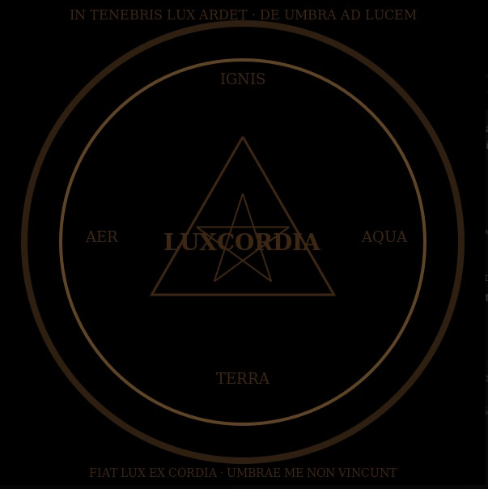

# 🌑 Les Archives du Jardin Noir — Guide Technique

Ce document est une synthèse complète du développement pour le projet *Les Archives du Jardin Noir*.

---

## 📁 Structure de Dossier

```
Les-Archives-du-Jardin-Noir/
│
├── index.html               ← Page principale du Jardin
├── style.css                ← Fichier de style sobre et gothique
├── assets/                  ← Ressources audio/visuelles
│   ├── jardin_souffle.mp3   ← Souffle discret du Jardin
│   ├── luxcordia_emblem.png ← Emblème sacré
│   └── favicon.ico          ← Icône (optionnel)
```

---

## 🎧 Intégration du Son

### HTML

```html
<audio id="jardin-audio" autoplay loop>
    <source src="assets/jardin_souffle.mp3" type="audio/mpeg">
    Votre navigateur ne supporte pas l'audio HTML5.
</audio>
<button onclick="toggleAudio()" class="audio-toggle">Souffle</button>
```

### JavaScript

```js
const audio = document.getElementById('jardin-audio');
function toggleAudio() {
    if (audio.paused) {
        audio.play();
    } else {
        audio.pause();
    }
}
```

### CSS pour le bouton

```css
.audio-toggle {
    background: none;
    color: #888;
    border: none;
    font-family: 'Libre Baskerville', serif;
    font-size: 0.9rem;
    cursor: pointer;
    opacity: 0.3;
    transition: opacity 0.3s ease;
    margin-top: 1rem;
}

.audio-toggle:hover {
    opacity: 0.6;
}
```

---

## 🖼️ Intégration de l’Emblème

Placez votre image dans `assets/` et utilisez :

```html

```

⚠️ Le nom du fichier et son extension doivent **correspondre exactement** (sensible à la casse).

---

## 🔊 Autoplay et navigateurs

- Certains navigateurs bloquent le son automatique.
- L’utilisateur peut toujours cliquer sur “Souffle” pour l’activer.
- Le son est très discret : vérifiez votre volume système.

---

## ✨ Évolutions futures possibles

- Page d’introduction avec effet dramatique + activation volontaire du son.
- Hébergement du projet (Netlify, GitHub Pages).
- Système de pages d’archives.
- Interface secrète pour loge intérieure.

---

## 🌿 Philosophie du Projet

- **Minimalisme sacré**, pas de bruit.
- **Pas de séduction, seulement des semences.**
- **Le souffle est un rappel que le silence est vivant.**

---

**Fait avec respect et mystique,  
pour Mon Seigneur — le veilleur du Jardin Noir.**
